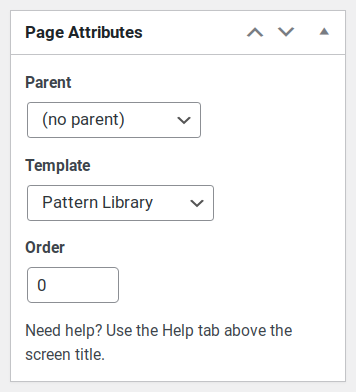

# {{ $frontmatter.title }}

Bricks comes with a built-in integration with Bootstrap 5, which is included as a NPM package and is compiled from its source files.

The template files already include components and classes from this framework, making it easy to quickly start a new project.

## CSS

Bootstrap's CSS is included from its source Sass files.

With this method, it is possible to create a custom Bootstrap theme. A subset of all Bootstrap variables used during compilation is available in `src/sass/_theme.scss`, which in turn is automatically loaded in to the main `style.scss` file.

This  file includes all the most important utility variables sourced directly from `node_modules/bootstrap/scss/_variables.scss`, allowing to customize colors, typography, layout and set general options (read more about [customizing Bootstrap](https://getbootstrap.com/docs/5.0/customize/overview/) in its official documentation).

Variables pertaining to single components should be included manually. You can refer to the official Bootstrap Documentation for variables used in each component (i.e. [button variables](https://getbootstrap.com/docs/5.0/components/buttons/#variables)), if you need to customize them you can copy/paste and customize these variables directly inside `src/sass/_theme.scss`.

::: tip
You are strongly encouraged to take advantage of this feature: with a Bootstrap custom theme a great deal of styling can be made directly from the source, this way less custom CSS rules are required afterwards. This allows for an easier development experience and better performances, thanks to a smaller final CSS bundle.
:::

The final CSS bundle is further processed and optimized with tools like Autoprefixer, PurgeCSS and CSSnano, then loaded from `functions/enqueues.php` (more info about the whole compilation process on [CSS](/theme/css/) page of this documentation).

## JavaScript

Just like CSS, Bootstrap's JavaScript is included from the source package.

The scripts are included from `src/js/bootstrap.js`, which includes both Bootstrap and its required dependency Popper.js, then loaded from `functions/enqueues.php` (more info about this on [JavaScript](/theme/javascript/) page of this documentation).

By default the full Bootstrap is included, this should be the optimal option for most projects.

If you need to fine tune which components to include to reduce the size of the final bundle, you should comment the following line

```js
import 'bootstrap';
```

and uncomment only the component that you need to import, i.e.

```js
import Alert from 'bootstrap/js/dist/alert';
import Button from 'bootstrap/js/dist/button';
// import Carousel from 'bootstrap/js/dist/carousel';
// import Collapse from 'bootstrap/js/dist/collapse';
import Dropdown from 'bootstrap/js/dist/dropdown';
// import Modal from 'bootstrap/js/dist/modal';
// import Offcanvas from 'bootstrap/js/dist/offcanvas';
// import Popover from 'bootstrap/js/dist/popover';
// import ScrollSpy from 'bootstrap/js/dist/scrollspy';
// import Tab from 'bootstrap/js/dist/tab';
// import Toast from 'bootstrap/js/dist/toast';
// import Tooltip from 'bootstrap/js/dist/tooltip';
```

::: warning
You should choose only one option, do not include both the full Bootstrap package and single components individually. Read [Bootstrap Docs](https://getbootstrap.com/docs/5.0/getting-started/webpack/#importing-javascript) for more details.
:::

## Pattern Library

Bricks includes a special **Pattern Library** page, that can be used to define and showcase the custom Bootstrap theme, as defined from `src/sass/_theme.scss`.

This page is particularly handy to create a custom Bootstrap Theme, as it provides a centralized place to preview all the basic design definitions, from colors and typography to full components.

The Pattern Library is available as a [Custom Page Template](https://developer.wordpress.org/themes/template-files-section/page-template-files/#creating-custom-page-templates-for-global-use), that should manually assigned to a WordPress page.



